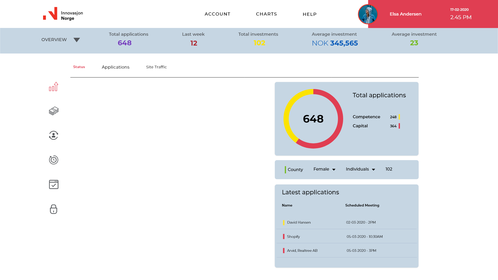

### 🖼️ Visual References

### 🚀 Quickstart

#### Setup

    - clone the repo https://git.diggit.space/workable-welcome/diggit.content.frontend.chart.git
    - understand the codebase
    - check out the developer handoff design link (url)

#### What To Do

    - implement the 2 charts with the data provided in Homepage.jsx (./src/..../Homepage.jsx)
    - have fun, and don't overdose on caffeine

### 🎨 Adobe XD Design Handoff

    Design Handoff: https://xd.adobe.com/view/82ec3234-0ad0-4067-86f2-8d244dcd22c2-d7bf/specs/

If you have XD installed, feel free to use the XD file. If not, simply use the design handoff url.

### 📁 Folder Structure

Here’s an overview of the folder structure. Each element is briefly described.

    ├── public/    # contains the HTML file so you can tweak it, for example, to set the page title and other static files
    ├── src/               # the main container for your project
    │   │
    │   ├── assets/          # images, icons, fonts, colors
    │   ├── components/          # anything that could be a reusable piece of UI lands here
    │   ├── screens/       # each screen is build with multiple components and together they create a screen to display for a user such as Homepage, About, Catalog etc
    │   ├── services/           # these files work as a temporary back-end for the project
    │   ├── utls/      # reusable JavaScript functions that support the project such as custom hooks

### 📖 Specification Overview:

- Target Screen: **1920x1080** (but should work for all common desktop sizes)
- Font: Montserrat (https://fonts.google.com/specimen/Montserrat)
- Asset folder: `./src/assets`
- Colors: check out `./src/assets`

### 🔑 Implementation Requirements

- **Charts**
  - decide on a library you want to use for your implementation
  - review the code base, find a suitable place for the charts
  - build 2 charts ( Individuals and Companies ) around the data included in the Homepage file
  - free up your creativity, charts are extremely flexible and it only depends on you how readable the data is
  - remember to include a gradient on the charts, it's a final touch to the project

### 🛣️ Roadmap ( clarify clickable elements ):

- **Top Navbar, Horizontal and vertical bars** - placeholders only.
- **Dropdowns** - feel free to add some bells and whistles, but it's not a requirement.
- **Charts** - charts don't include any clickable elements, but pop-up hover effects filled with data, improves readability.

### 🗁 Recommended Libraries

- **Charts** - Chart.js; that's what we consider the most convenient one, but feel free to work with any library that works for you!
- React modules are fine, but for any **CSS logic** - styled-components.
- Any **custom animation?** - gsap.

### 👴 Challenge Context

Innovation Norway is in charge of giving Norwegian ideas global opportunities. They offer critical help and support to startups. Each and every day, both companies and individuals book meetings with their advisors.

The first step towards better services is a clear overview of current affairs. Innovation Norway needs to see how many companies and individuals they are in contact with. In the future, this dashboard can also show valuable insights such as the overall satisfaction, newly identified opportunities as well as potential efficiency improvements in their processes.
